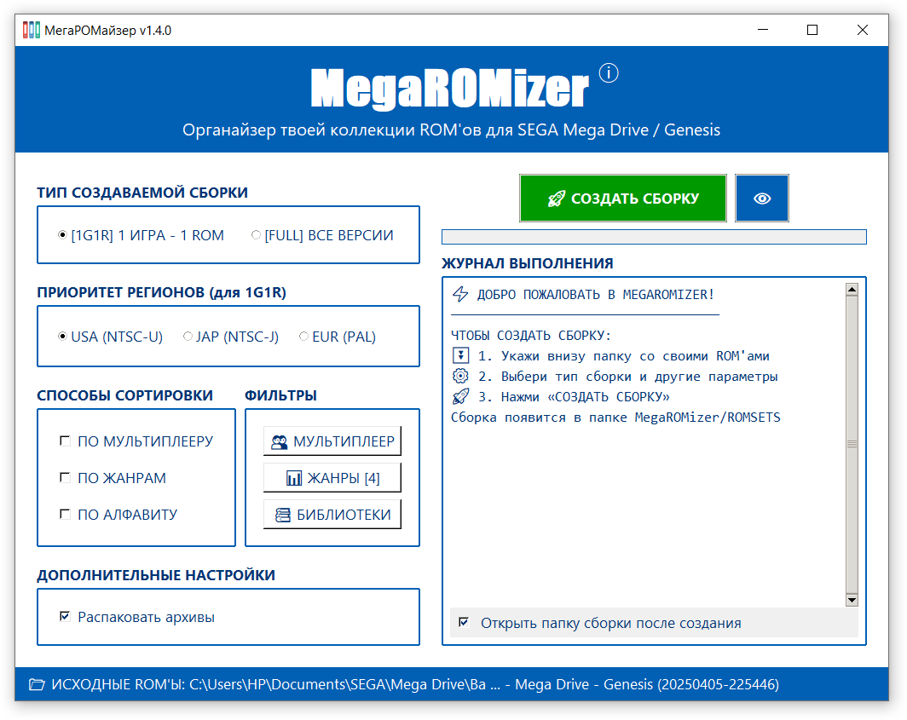

# MegaROMizer v1.4.0

  
  
  

  <b>MegaROMizer</b> - очень простой и удобный инструмент для создания своей личной 
  библиотеки игр для SEGA Mega Drive / Genesis:
     • интуитивно понятный интерфейс 🖥
     • собственная база данных 🗃

  

---

<b>📋 ПОКАЗАТЬ СОДЕРЖАНИЕ</b>

  
- [💻 Системные требования](#system)
- [📁 Состав дистрибутива](#files)
- [🗃 База данных](#database)
- [⚙️ Файл настроек](#settings)
- [🚀 Возможности](#features)
- [🛠️ Использование](#usage)
- [🔐 Активация полной версии](#activation)
- [📬 Поддержка и обратная связь](#support)

---

<!-- СКРИНШОТ -->

  

---

## 💻 Системные требования 
- **ОС:** Windows 10 / 11 (x64)
- **Разрешение экрана:** 1280x1024 и выше
- **Место на диске:** 50 МБ + место под сборки
- **Поддерживаемые форматы:** `.bin`, `.gen`, `.md`, `.smd`, `.sms*`, `.7z`, `.zip`

> * формат `.sms` поддерживается только для игры **Phantasy Star Fukkokuban**, которая является перевыпуском игры SEGA Master System (Mark III), из-за чего может корректно работать на флешкартриджах только с расширением `.sms`

---

## 📁 Состав дистрибутива 

| Файл | Описание | Примечание |
|------|----------|------------|
| `MRZR.exe` | Исполняемый файл |  |
| `data\mrzr_base.dat` | База данных | Обязательна для работы |
| `mrzr.ico` | Иконка программы |  |
| `README.txt` | Документация |  |
| `CHANGELOG.txt` | История изменений |  |
| `ROMSETS\` | Папка для сборок | Создается при первой сборке |
| `data\mrzr_settings.json` | Настройки программы | Создается при первом закрытии |
| `data\mrzr_filters.json` | Настройки фильтров | Создается при изменении фильтров |
| `data\mrzr_key.lic` | Файл активации | Создается после активации |

---

## 🗃 База данных 
Файл `mrzr_base.dat` содержит информацию о **всех официальных играх SEGA Mega Drive / Genesis**, выпущенных на картриджах в **1988–1998 гг.**, а также играх сервиса Sega Channel:

- ✅ Все региональные версии и ревизии, а также версии с переводом на русский
- ✅ Уникальная жанровая классификация
- ✅ Типы мультиплеера (Co-op, PvP, Turn-base, Hot-seat)

Статистика базы данных (v140):
- Уникальных игр: 885 (версий: 2031)
- Офиц. на картриджах: 877 игр (1417 версий)
- Sega Channel: 50 игр (51 версия)
- С русским переводом: 290 игр (563 версии)
- С мультиплеером: 454 игры (918 версий)

---

## ⚙️ Файл настроек 
Файл `mrzr_settings.json` создаётся и обновляется автоматически при закрытии программы.

| Параметр | Описание |
|----------|----------|
| `last_base_folder` | Путь к папке с исходными ROM'ами |
| `auto_open_folder` | Открывать папку сборки после создания (`true`/`false`) |
| `last_mode` | Последний тип сборки (`1`=FULL, `2`=1G1R) |
| `last_region` | Последний регион (`1`=USA, `2`=JAP, `3`=EUR) |
| `sort_by_genre` | Сортировка по жанрам (`true`/`false`) |
| `sort_by_multiplayer` | Сортировка по типам мультиплеера (`true`/`false`) |
| `sort_by_alphabet` | Сортировка по алфавиту (`true`/`false`) |
| `window_width` | Ширина окна (≥1024) |
| `window_height` | Высота окна (≥768) |
| `window_x` | Позиция окна по X |
| `window_y` | Позиция окна по Y |
| `extract_7z_zip` | Распаковка .7z и .zip архивов (`true`/`false`) |
| `show_tooltips` | Показывать всплывающие подсказки (`true`/`false`) |

> ⚠️ Параметр `show_tooltips` изменяется только вручную (при закрытой программе), 
> остальные параметры изменяются автоматически при закрытии программы.

---

## 🚀 Возможности 

### 📌 Варианты сборки
- **Два типа сборки:**
   `[1G1R] 1 ROM - 1 ИГРА` - выбирает только одну версию игры (более позднюю и с учётом ПРИОРИТЕТА РЕГИОНОВ, в приоритете версии с русским переводом)
   `[FULL] ВСЕ ВЕРСИИ` - создаёт папку для каждой игры со всеми региональными версиями и ревизиями
- **Выбор основного региона (для 1G1R):** `USA (NTSC-U)`, `JAP (NTSC-J)`, `EUR (PAL)`
- **Восемь способов сортировки:** по мультиплееру, по жанрам, по алфавиту и их комбинации

### 🔹 ФИЛЬТРЫ (новое в v1.4.0)
- Фильтр мультиплеера — исключение игр определённых режимов (Solo, Co-op, PvP, Turn-base, Hot-seat)
- Фильтр жанров — исключение игр выбранных жанров/поджанров, выбор глубины вложенности папок при сортировке (1-4)
- Фильтр библиотек — выбор типов игр (офиц. на картриджах, Sega Channel, переводы на русский)

### 🔧 Основные функции
- 🔍 **Сканирование папки** — находит ROM'ы в указанной и всех вложенных папках
- 📦 **Поддержка архивов** — работает с `.zip` и `.7z` без предварительной распаковки
- 🧠 **Умная идентификация** — определяет ROM'ы по содержимому, а не по имени файла
- 📈 **Приоритет ревизий** — выбирает более позднюю ревизию игры
- 📂 **Формирование сборки** — создаёт новую структуру методом копирования
- 🔢 **Счётчики ROM'ов** — имя каждой папки в сборке содержит число вложенных ROM'ов
- 👁️ **Предпросмотр** — показывает состав сборки без копирования файлов (кнопка `👁️`)
- 🔍 **Поиск в предпросмотре** — `Ctrl+F`, `Ctrl+G`, `Ctrl+B` с подсветкой результатов
- 📄 **Паспорт сборки** — создаёт файл `.txt` в папке сборки с параметрами и составом
- 📊 **Структура жанров** — просмотр дерева жанров прямо из базы (иконка `📊`)

### 🛡 Надёжность и контроль
- 💾 **Сохранение настроек** — запоминает последние выбранные параметры
- ⏹ **Прерывание сборки** — остановка процесса с удалением незавершённой папки
- 🔔 **Уведомление об обновлении** — при запуске сообщает в лог о новой версии

### 🎨 Интерфейс и удобство
- 💬 **Всплывающие подсказки** — подробные пояснения вариантов сборки
- 📂 **Автооткрытие папки** — готовая сборка открывается автоматически
- 📋 **Копирование лога, предпросмотра, дерева жанров** — через `Ctrl+C` / ПКМ
- 🔍 **Поиск в окне предпросмотра** — через комбинации `Ctrl+F`, `Ctrl+G`, `Ctrl+B`
- 📱 **DPI-коррекция** — поддержка масштабирования экрана 100%, 125%, 150%, 175%

---

## 🛠️ Использование 
Создание сборки за три простых шага:

1️⃣ **Указать папку с ROM'ами** — клик по синей панели внизу окна  
2️⃣ **Выбрать параметры сборки** — подробные подсказки при наведении курсора  
3️⃣ **Нажать «СОЗДАТЬ СБОРКУ»** — готовая сборка появится в папке `\ROMSETS`

**Формат имени папки сборки**: 
    `ТИП СБОРКИ [РЕГИОН] [СОРТИРОВКА] [ДАТА_ВРЕМЯ] [КОЛ-ВО ROM'ОВ]`

**Примеры:**

- Режим 1G1R, основной регион USA (NTSC-U), сортировка по жанрам:  
  `1G1R [PRIO-US] [GENRE] [2026.03.03_00-04-52] [877]`
- Режим 1G1R, основной регион JAP (NTSC-J), без сортировки:  
  `1G1R [PRIO-JP] [2026.03.03_00-04-52] [877]`
- Режим FULL, с сортировкой по мультиплееру и жанрам:  
  `FULL [MP-GENRE] [2026.03.25_11-39-43] [1417]`
- Режим 1G1R, сортировка по мультиплееру, жанрам и алфавиту: 
  `1G1R [MP-GENRE-ABC] [2026.04.05_12-00-00] [877]`

---

## 🔐 Активация полной версии 
**Программа распространяется в пробной версии**, которая позволяет испытать весь функционал 
MegaROMizer на **32 случайных играх** из твоей коллекции ROM'ов.
Получить ключ для полной версии можно в благодарность за поддержку развития проекта 👍

**Для активации полной версии:**
1. В главном окне нажать кнопку **«ПОЛНАЯ ВЕРСИЯ»**
2. Следовать инструкциям в открывшемся окне

---

## 📬 Поддержка и обратная связь 
- **VK:** [vk.com/sega_my](https://vk.com/sega_my)
- **Telegram:** [@chertolyasii](https://t.me/chertolyasii)
- **Email:** [igor.chertolyas@yandex.ru](mailto:igor.chertolyas@yandex.ru)

---

  <b>© 2026 Чертоляс Игорь</b> 
  С 💙 к SEGA и уважением к её фанатам

